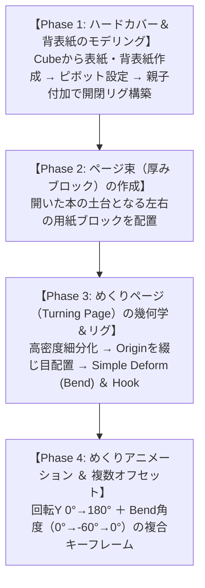

# 📖 Blender Made Easy式 本の開閉 ＆ ページめくりアニメーション 完全制作工程 ＆ 全手順の意味・徹底分析書

**元動画**: [Blender Tutorial - Book Opening Animation](https://www.youtube.com/watch?v=geyC6FfMFf8)  
**チャンネル**: Blender Made Easy 様  

---

## 🧭 全工程ロードマップ ＆ 制作フェーズ

---

## 🔬 チャプター別：全手順の具体的操作 ＆「その手順の意味・理由」の徹底分析

---

### Step 1: 【背表紙（Spine）と表紙（Cover）のモデリング ＆ ピボット設定】
- **具体的な操作**:
  1. Cubeを追加し、厚みのある板状（表紙サイズ: 幅1.5m, 縦2.2m, 厚さ0.04m）に変形。
  2. 中央に細長い背表紙（Spine: 幅0.2m, 縦2.2m, 厚さ0.04m）を作成。
  3. 左右の表紙の **原点（Origin / Pivot Point）** を、それぞれの「背表紙と接するエッジ」に設定（3Dカーソル経由で `Set Origin to 3D Cursor`）。
  4. 左右の表紙を背表紙（Spine）に親子付け（Parent to Spine）。
- **💡 なぜこの手順を行うのか？（手順の意味と効果）**:
  - **なぜ Origin の移動が必須なのか？**: デフォルトのオブジェクト中心（バウンディングボックス中央）のままだと、表紙が自分自身の中心で回ってしまい、背表紙から外れて空中浮遊してしまう。エッジに原点を移動することで、**蝶番（ヒンジ）のように背表紙を支点として綺麗にパカッと開閉** できる。
  - **親子付けの意味**: 背表紙を動かしたり回転させたりした際、表紙やページ全体が一体となって追従するリグの土台となる。

---

### Step 2: 【ページ束（左右の用紙ブロック）の配置】
- **具体的な操作**:
  1. 表紙の内側に収まるサイズで、左右に厚みのあるブロック（Page Blocks: 厚さ0.15m程度）を配置。
  2. 小口（断面）にわずかなインセットやスリットを入れ、束ねられた無数の紙の質感を表現。
- **💡 なぜこの手順を行うのか？（手順の意味と効果）**:
  - **なぜ全ページを1枚ずつ作らないのか？**: 300ページの厚みをすべて個別ポリゴンで作ると、ポリゴン数が膨大になり動作が激重になる。開いた本の「めくらない大半のページ」は1つのソリッドブロックとしてまとめ、めくる対象の数枚だけを個別メッシュにすることで、**圧倒的な軽量化とリアリズムを両立** させる。

---

### Step 3: 【めくりページ（Turning Page）の細分化 ＆ 原点設定】
- **具体的な操作**:
  1. 平面（Plane）を作成し、ページサイズ（幅1.4m, 縦2.1m）に合わせる。
  2. 編集モードで、特に **めくり方向（X軸）に 20〜30 回のループカット（細分化）** を入れる。縦方向（Y軸）も数分割。
  3. ページの原点（Origin）を、**綴じ目側のエッジ（X=0）** に完全に合わせる。
- **💡 なぜこの手順を行うのか？（手順の意味と効果・核心部）**:
  - **なぜX軸方向に高密度な分割が必要なのか？**: ポリゴン数が少ない（四角面1枚の）状態では、モディファイアを掛けても紙が板のまま折れ曲がってしまい、紙特有の滑らかなアーチ状の湾曲が表現できない。
  - **原点を綴じ目に置く理由**: ページが180度めくれて反対側に倒れる際、綴じ目からページが引っ張られたり突き抜けたりする破綻を防止する。

---

### Step 4: 【Simple Deform (Bend) による紙のしなり表現】
- **具体的な操作**:
  1. ページに **`Simple Deform Modifier`** を追加。
  2. タイプを **`Bend`（曲げ）** に設定。
  3. 軸（Axis）を **`Z`**（または座標軸に応じた適切な軸）に設定。
  4. 角度（Angle）を変化させて曲がり具合を確認。
- **💡 なぜこの手順を行うのか？（手順の意味と効果）**:
  - **なぜ回転（Rotation）だけではダメなのか？**: 単にページを0°から180°へ回転させるだけだと、下敷きや鉄板を裏返すような「完全に平らな硬い板」に見えてしまう。
  - **Bend モディファイアの意味**: ページがめくれ上がる途中で、先端が重力と空気抵抗によって下向きにしなり、頂点で最も大きく湾曲し、着地に向かって再び平らに戻るという、**「紙の弾性と柔軟性」をたった1つのパラメータ（Angle）でプログラマブルに制御** できる。

---

### Step 5: 【Hook ＋ 頂点グループによる先端のめくれ制御】
- **具体的な操作**:
  1. ページの先端角（めくりはじめのコーナー頂点群）を選択し、ウェイトグラデーションを持つ **頂点グループ** を作成。
  2. **`Hook Modifier`** を追加し、Empty（Plain Axis）をターゲットに指定。
  3. Empty を持ち上げることで、ページの角（コーナー）だけが先行してクイッとめくれ上がる。
- **💡 なぜこの手順を行うのか？（手順の意味と効果）**:
  - **紙は均等にはめくれない**: 人間が指でページをめくる時、ページ全体が一斉に持ち上がるのではなく、**「まず指が掛かった角（コーナー）がめくれ上がり、後から全体がついてくる」**。Hook Modifier を使うことで、この物理的な指の引っ掛け動作を自然にシミュレートできる。

---

### Step 6: 【アニメーションキーフレームの連動設計】
- **具体的な操作**:
  1. **フレーム 1〜20**: 本が開く（表紙が 0° から左右に開き、ページ束が現れる）。
  2. **フレーム 25〜60**: 1枚目のページめくり
     - **Rotation Y**: 0°（右側で閉じた状態） → 90°（真上に直立） → 180°（左側に倒れて着地）。
     - **Bend Angle**: 0° → -55°（真上に持ち上がった瞬間、最も強くしなる） → 0°（着地でフラットに戻る）。
     - **イージング（ベジェ補間）**: 離陸時はゆっくり、中空を素早く通過し、着地時にフワリと減速するリアルな緩急。
- **💡 なぜこの手順を行うのか？（手順の意味と効果）**:
  - 単純な等速直線運動（リニア）では機械的でCG臭くなる。回転角と曲げ角度のピークをわずかにオフセットさせることで、**風をはらんでパサッとめくれる有機的な空気感** が生まれる。

---

### Step 7: 【複数ページのオフセット複製（パラパラめくり）】
- **具体的な操作**:
  1. めくりページとEmptyを複製（`Shift + D`）。
  2. タイムライン上でキーフレームを 8〜12 フレーム後方にずらす（オフセット）。
  3. 2枚目、3枚目が連続してめくれるシーケンスを作成。
- **💡 なぜこの手順を行うのか？（手順の意味と効果）**:
  - 1枚だけめくれるよりも、前のページが倒れきる直前に次のページが追いかけるようにめくれ始めることで、**読書や魔法書のようなリッチなモーショングラフィックス** に昇華される。
