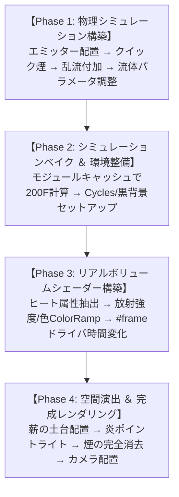

# 🔥 カサハラCG式 リアル焚き火完全制作工程 ＆ 全手順の意味・徹底分析書

**元動画**: [【Blender】初めての炎！【焚き火篇】リアルな炎を簡単に作れます！](https://www.youtube.com/watch?v=lodqjYDXIxk)  
**解説者**: カサハラ CG 様  

---

## 🧭 全工程ロードマップ ＆ 制作フェーズ

---

## 🔬 チャプター別：全手順の具体的操作 ＆「その手順の意味・理由」の徹底分析

---

### Step 1: 【球体・ドメインを追加】(00:23〜00:58)
- **具体的な操作**:
  1. 初期シーンのキューブ等を全削除。
  2. `Shift + A` で **UV球** を追加し、スケールを `0.4` に縮小（`S` → `0.4`）。
  3. UV球を選択し、メニューの `オブジェクト` ＞ `クイックエフェクト` ＞ **`クイック煙` (Quick Smoke)** を実行。
- **💡 なぜこの手順を行うのか？（手順の意味と効果）**:
  - **なぜ球体なのか？**: 焚き火の火元は一点ではなく、ある程度の体積を持った熱源から燃え上がる。球体を使うことで、全方位に均等かつ自然に火炎ガスを発生させられる。
  - **なぜ 0.4 に縮小するのか？**: 初期サイズの半径1m（直径2m）の球体だと、焚き火ではなく山火事や大爆発のような巨大な炎になってしまう。キャンプ用の焚き火の火床サイズ（直径約40cm）に合わせるために `0.4` とする。
  - **クイック煙を使う意味**: Blenderの流体物理演算（MantaFlow）は手動で設定すると「フロー設定」「ドメイン作成」「ボリュームマテリアル割り当て」など十数ステップ必要になるが、クイック煙を実行することで、**発生源に合わせた外枠「ドメイン（計算領域）」と初期ボリュームシェーダーが一発で自動生成** される。

---

### Step 2: 【風の影響を追加（乱流フォースフィールド）】(00:58〜01:15)
- **具体的な操作**:
  1. `Shift + A` ＞ `フォースフィールド` ＞ **`乱流` (Turbulence)** を追加。
  2. 物理演算プロパティで、**強さ (Strength) を `0.4`**、**ノイズ量 (Noise Amount) を `0.4`** に設定。
- **💡 なぜこの手順を行うのか？（手順の意味と効果）**:
  - **なぜ無風状態ではダメなのか？**: フォースフィールドが無いと、熱気流は真上に向かって真っ直ぐ垂直に昇るだけの「円柱状の不自然な煙・炎」になってしまう。
  - **なぜ「風」ではなく「乱流」なのか？**: 一定方向の「風（Wind）」だと炎が斜めに吹き流されるだけだが、「乱流（Turbulence）」は3次元空間の各地点でランダムな方向と強さの渦を発生させるため、**空気が揺らいで火の先端がチラチラと舞う自然な焚き火のゆらめき** が生まれる。
  - **なぜ 0.4 という数値なのか？**: 強さが 1.0 以上だと炎が吹き散らされて形を維持できなくなり、逆に 0.1 以下だと直線的すぎる。`0.4` は焚き火の穏やかなゆらぎを保つ黄金比。

---

### Step 3: 【炎の詳細設定（フロー ＆ ドメイン）】(01:15〜03:01)
- **具体的な操作**:
  1. **発生源（球体）のフロー設定**:
     - `フロータイプ`: `煙` → **`火炎` (Fire)** に変更。
     - `燃料` (Fuel): **`2.0`** に増量。
     - `フローソース`: `表面からの発生距離` を **`1.0`** に設定。
     - `テクスチャ`: チェックを入れ、新規テクスチャ（タイプ: **`クラウド` (Clouds)**, サイズ: **`0.1`**, コントラスト: **`5.0`**）を割り当てる。
  2. **ドメイン（外枠）の設定**:
     - `分割の解像度` (Resolution Divisions): **`128`**（または256）。
     - `適応ドメイン` (Adaptive Domain): **チェックを入れる**。
     - `火炎` タブ: **`渦度` (Vorticity) を `0.1`**、**`反応速度` (Reaction Speed) を `1.0`** に設定。
- **💡 なぜこの手順を行うのか？（手順の意味と効果）**:
  - **フロータイプ「火炎」の意味**: 初期値の「煙」や「火炎＋煙」ではなく「火炎」に限定することで、黒煙を抑制し、純粋な燃焼ガスのシミュレーションに集中させる。
  - **燃料 `2.0` の意味**: 燃料値（Fuel）は燃焼の持続時間を決める。1.0だと発生した瞬間に消えてしまい炎が小さくなるが、2.0にすることで炎が上部まで勢いよく伸びる。
  - **表面距離 `1.0` の意味**: 球体の表面境界だけでなく、球体内部から周囲1mの空間全体から均一にガスを噴出させ、火の根元に厚みを持たせる。
  - **Cloudsテクスチャ（サイズ0.1 / コントラスト5.0）の意味（超重要技法）**:
    - 通常、球体からガスを発生させると「ツルッとした球体型の炎」が出てしまう。
    - そこに高コントラストなノイズテクスチャを掛けることで、**「ガスが出る場所」と「出ない場所」の激しいムラが生まれ、炎が幾筋にも千切れて立ち上る有機的な形状** になる。
  - **適応ドメイン（Adaptive Domain）の意味**: 炎が存在する空間だけドメインのバウンディングボックスを自動伸縮させる。空間全体の無駄な計算を省き、PCのメモリ消費とベイク時間を大幅に短縮する。
  - **解像度 `128` の意味**: ボクセルの細かさ。64だと炎がブロック状のモザイクに見えてしまうが、128以上にすることでディテールが滑らかな流体になる。

---

### Step 4: 【炎をベイク（データ計算の確定）】(03:01〜03:50)
- **具体的な操作**:
  1. キャッシュのタイプを `リプレイ` → **`モジュール` (Modular)** に変更。
  2. `リジューム可` (Is Resumable) にチェック。
  3. `終了フレーム` を **`200`** に設定。
  4. **`データをベイク` (Bake Data)** をクリックして物理演算を事前計算。
- **💡 なぜこの手順を行うのか？（手順の意味と効果）**:
  - **なぜリアルタイム再生ではなくベイクが必要なのか？**: 流体演算は非常に高負荷なため、リアルタイム再生ではコマ落ちして正確な形状を確認できない。また、レンダリング時にフレームごとの形状を確定させるためにディスクキャッシュへ書き出す必要がある。
  - **モジュール＋リジューム可の意味**: ベイク途中で一時停止・再開が可能になり、長時間の物理計算がクラッシュしても直前のフレームから復旧できる。

---

### Step 5: 【背景 ＆ Cycles レンダリング設定】(03:50〜04:13)
- **具体的な操作**:
  1. `ワールドプロパティ` ＞ `カラー` を **完全な黒 (RGB 0,0,0)** に設定。
  2. `レンダープロパティ` ＞ `レンダーエンジン` を `Eevee` → **`Cycles`** に変更。
  3. デバイスを `GPU`、サンプリング数を `64`、`デノイズ` にチェック。
- **💡 なぜこの手順を行うのか？（手順の意味と効果）**:
  - **黒背景にする意味**: 炎は自発光（Emission）オブジェクトであるため、周囲が明るいと発光感が飛んでしまう。暗闇にすることで、炎の鮮やかなグラデーションと周囲への照り返しを最大限に際立たせる。
  - **なぜ Cycles なのか？**: Eevee（ラスタライズ）ではボリュームの多重散乱や炎が周囲の木材を物理的に照らす間接光（Global Illumination）の表現に限界がある。Cycles（パストレーシング）を使うことで、炎の光が薪に反射する本物の陰影が計算される。

---

### Step 6: 【炎のマテリアル設定（Principled Volume）】(04:13〜07:17)
- **具体的な操作**:
  1. シェーダーエディタでドメインの `プリンシプルボリューム` を開く。
  2. **ヒート属性の接続**:
     - `Shift + A` ＞ `入力` ＞ **`属性` (Attribute)** ノードを追加し、名前を **`heat`** と入力。
  3. **放射強度の制御**:
     - `heat` の `係数 (Fac)` → `カラーランプ`（0.0: 黒、0.45: 白、0.7: **濃いグレー**）。
     - `カラーランプ` → **`数式` (乗算: 50.0)**。
     - テクスチャ座標 (生成) → **`マッピング` (位置Zの入力欄に `#frame` と入力)** → **`ノイズテクスチャ` (スケール: 8.0, 細かさ: 9.2, 歪み: 1.0)** → `カラーランプ`。
     - 二つの値を **`数式` (乗算)** で掛け合わせ、プリンシプルボリュームの **`放射の強さ` (Emission Strength)** に接続。
  4. **放射カラーの制御**:
     - `heat` の `係数 (Fac)` → 新規 `カラーランプ`（左: **鮮やかなオレンジ**、右: **黄色**、オレンジを右寄りに寄せる）。
     - カラーをプリンシプルボリュームの **`放射色` (Emission Color)** に接続。
- **💡 なぜこの手順を行うのか？（手順の意味と効果・核心部）**:
  - **`heat` 属性とは何か？**: MantaFlow シミュレーション内部で計算された「温度・熱量データ（0.0〜1.0）」。炎の中心部は温度が高く、外側に行くほど冷める。これを取り出すことで、温度に応じた物理的な発光を制御できる。
  - **なぜカラーランプに「濃いグレー」を追加するのか？**:
    - 黒→白だけだと、炎の表面が急激に透明になり、硬い板のように見えてしまう。
    - 白の右側に「濃いグレー」を配置することで、**最も熱い芯の部分がピークで光り、表面に向かって滑らかにフェードアウトする自然なグラデーション** が作れる。
  - **なぜ乗算 50.0 なのか？**: BlenderのPrincipled Volumeの放射強度はデフォルト値（1.0）では暗すぎる。50倍に増幅することで、CyclesのHDR環境で周囲を照らす本物の発光体になる。
  - **`#frame` ドライバによる Z軸移動ノイズの意味（神技法）**:
    - シミュレーションのメッシュ形状だけでなく、**シェーダー内部のノイズテクスチャがフレーム進行とともに下から上へスクロール（Z軸上昇）** する。
    - これにより、低解像度のシミュレーションであっても、炎の内部に細かい炎の繊維・ゆらめきのアニメーションが合成され、劇的にリアルさが増す。
  - **放射色のオレンジを右側に寄せる理由**: 炎の根元〜中心は超高温の黄色・白色だが、面積の8割は外側のオレンジ色である。オレンジのハンドルを右に寄せることで、黄色く光る芯と全体を包む暖色オレンジのバランスが整う。

---

### Step 7: 【土台（木材）の配置 ＆ ライト ＆ 最終仕上げ】(07:17〜10:48)
- **具体的な操作**:
  1. 炎の足元に薪（木材オブジェクト）を円錐状・井桁状にクロスさせて配置。
  2. 炎の中心（少し高めの位置）に **`ポイントライト` (Point Light)** を追加し、エネルギーを大きく（例: 500〜800W）、色を暖色オレンジに設定。
  3. ドメインのプリンシプルボリュームの **`密度` (Density) を `0.0`** にする。
  4. カメラをローアングルに設置し、F値や画角を調整して最終レンダリング。
- **💡 なぜこの手順を行うのか？（手順の意味と効果）**:
  - **なぜ炎自身があるのにポイントライトを追加するのか？**: ボリューム自体の発光（Mesh Emission）は Cycles でノイズ（ファイアフライ）が発生しやすく、光の届く範囲の計算に膨大なサンプル数が必要になる。中心にポイントライトを置くことで、**薪の表面や地面をクリーンかつ高速に照らし出し、ドラマチックな陰影を作る** ことができる。
  - **なぜ密度（Density）を 0.0 にするのか？**: MantaFlow の「火炎」設定でも微小な煙（煤）が生成される。Density が残っていると炎が黒い煤で覆われて濁ってしまうため、0.0 にして煙を完全に不可視化し、**透き通るような美しい炎の輝き** だけを抽出する。
